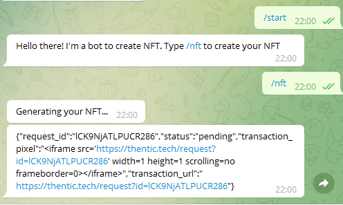

# NFT telegram bot

1. In order to your App to run, please generate the a `TELEGRAM BOT API KEY` and another one for `THENTIC`.
2. Add them in keys.py file.

You can find more info about THENTIC API KEY [here](https://thentic.gitbook.io/api-docs/).

You can find more info about TELEGRAM API KEY [here](https://tutorial.cytron.io/2021/09/01/how-to-create-a-telegram-bot-get-the-api-key-and-chat-id/).

# Functionality

- Bot interact with human providing two options: /start and /nft
- If /nft it's choosen, bot will generate an NFT contract using thentic API
- Example bellow:

# Future features

1. To give the user the option to chose the name and short name from the NFT contract
2. Mint an NFT
3. Store in a database the list NFTs created
